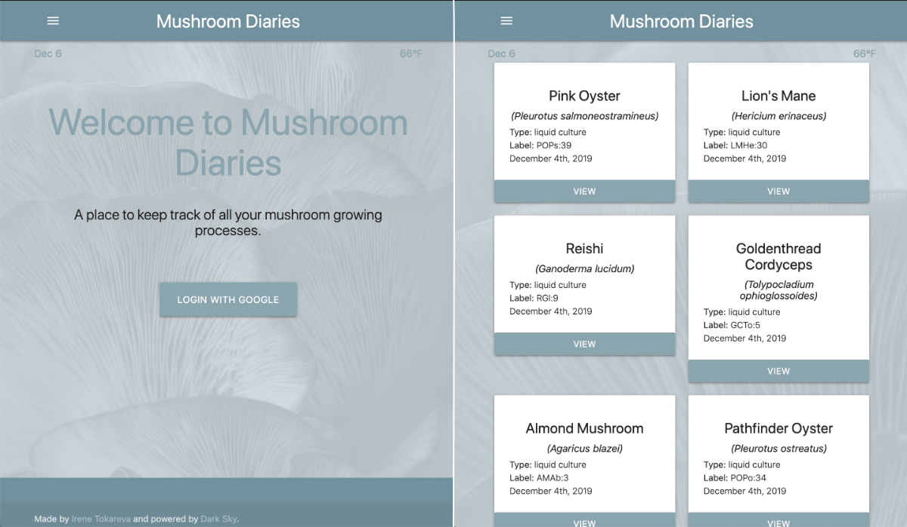
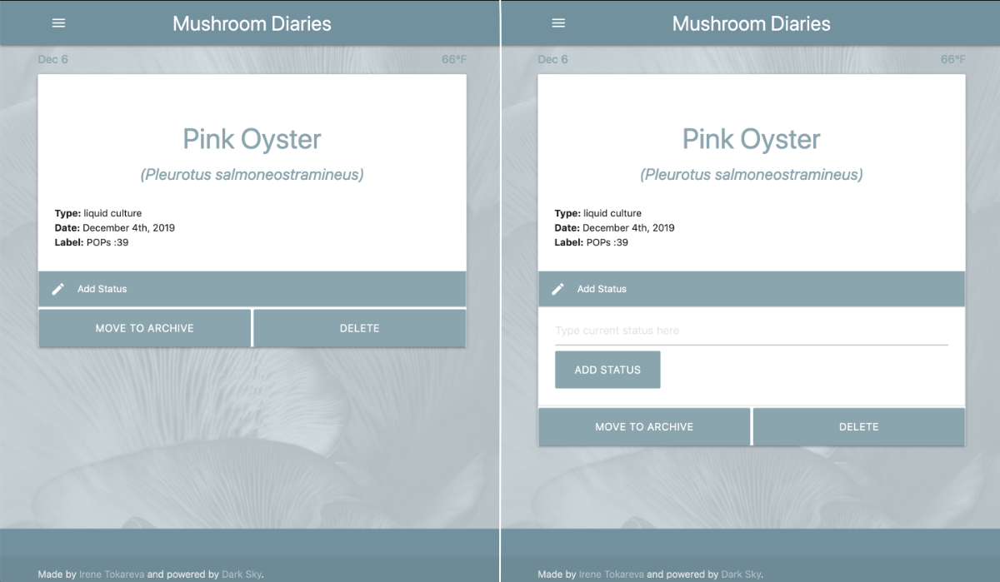
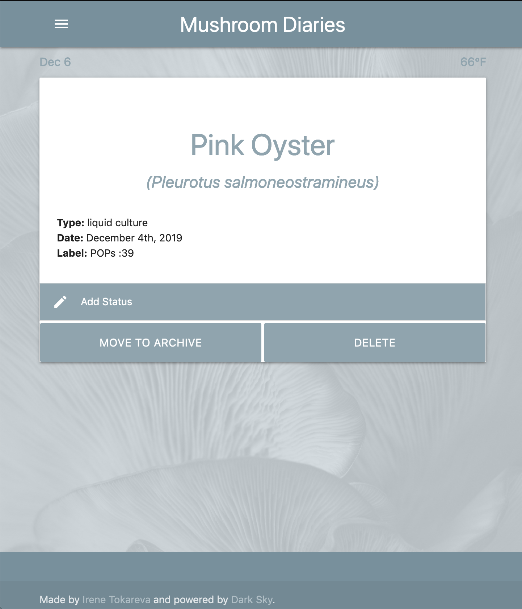
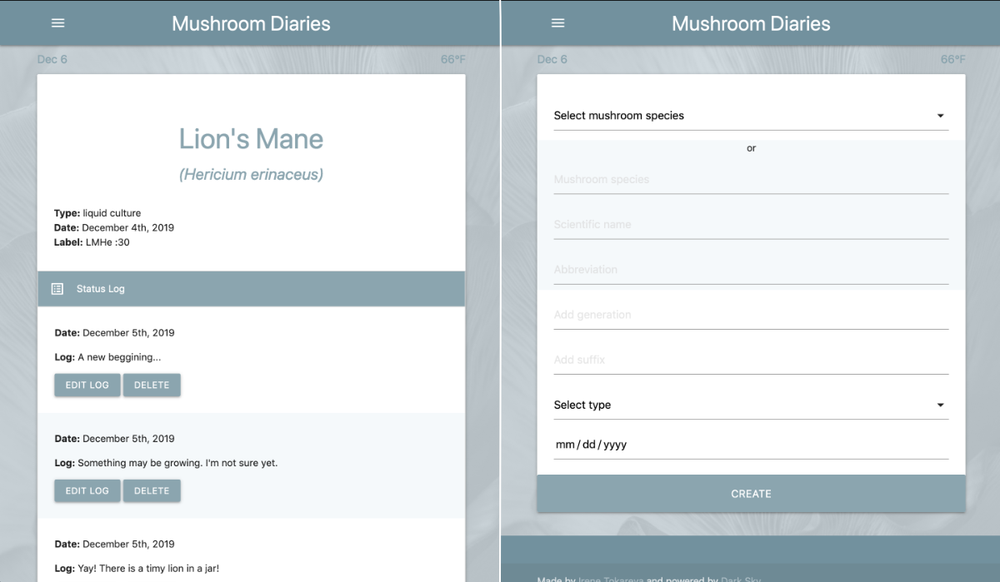
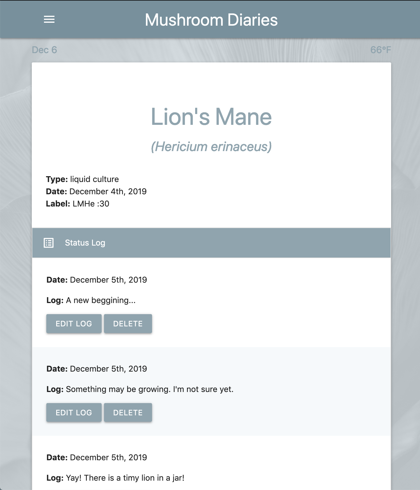
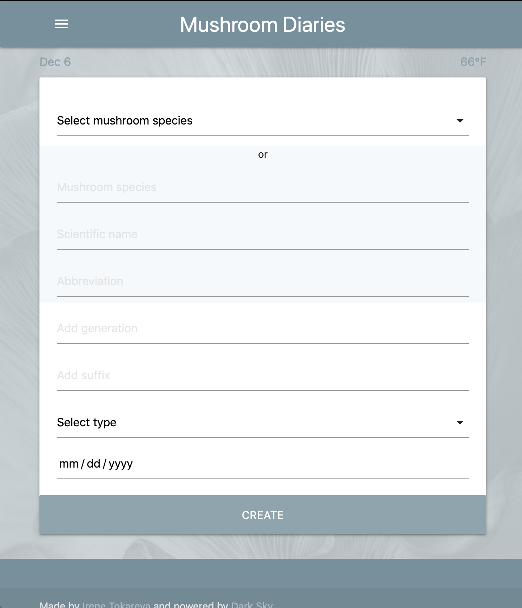

# Mushroom Diaries

A place to keep track of all mushroom you are growing.
**[Take a look!](https://mushroom-diaries.herokuapp.com/)**

## User Stories

AAU I want to see a landing page with a log in link

AAU I want to see different website layouts in response to different viewport sizes.

AAU I want to see all my current cards  on my landing page after logging in.

AAU I want to be able to add a new card with information about mycelium I am working with.

AAU I want to see current date and temp, preferably correlated with background of the app.

AAU I want to see detailed card if I click on a view button of a card on a landing page.

AAU I want to be able to archive cards that are not current anymore.

AAU I want to be able to add logs for each mycelium I am working with, as well as a summary note about this experience.

## Screenshots

## Technologies Used
* HTML/CSS/Javascript
* Node/Express
* MongoDB/Mongoose
* DarkSky API

## Next Steps
1. edit mycelium information
2. back to top button
3. calendar
4. weather api for current location
5. connect with your own weather station
6. add images to logs
7. create a child button on a show page
8. ability to see parent mycelium and children mycelium for each card (where parent is provided)

